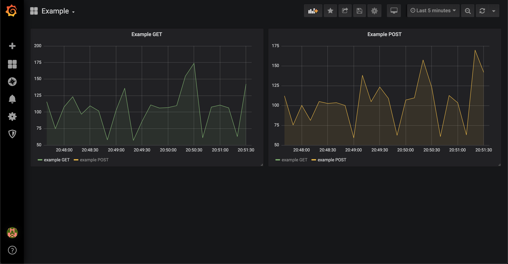

# livetest
#### livetest is a continous testing service/tool for testing backend endpoints/features in development or production environments. Test endpoints, get notified when they are down, and track response time

# Get Started

## Binary Installation
```
$ go get -u github.com/rknizzle/livetest/cmd/livetest
```
Must include a config.json file with the binary and start with:

`livetest` or `livetest config.json`


## Test example with Docker Compose
```
docker-compose up
```

# Visualization
### Connect datastore to grafana to visualize time taken to complete requests over time


#### Instruction to install grafana: https://grafana.com/docs/grafana/latest/installation/

# Config

### concurrency
number of requests that can run at the same time

### datastore
Store the result of each request to track responses over time. Initial supported database: Postgresql

### notification
Send out a notification if a request fails or returns an unexpected response. Initial supported notifications: HTTP Request

## Config Example:
```
{
    "concurrency": 2,
    "datastore": {
        "db": "postgres",
        "dbname": "postgres",
        "host": "localhost",
        "password": "password",
        "port": 5432,
        "user": "postgres"
    },
    "jobs": [
        {
            "expectedResponse": {
                "statusCode": 200
            },
            "frequency": 10000,
            "headers": {},
            "httpMethod": "GET",
            "requestBody": {},
            "title": "example GET",
            "url": "http://postman-echo.com/get?foo1=bar1&foo2=bar2"
        },
        {
            "expectedResponse": {
                "statusCode": 200
            },
            "frequency": 15000,
            "headers": {
                "Content-Type": "application/json"
            },
            "httpMethod": "POST",
            "requestBody": {
                "data": "value"
            },
            "title": "example POST",
            "url": "http://postman-echo.com/post"
        }
    ],
    "notification": {
        "msg": {
            "headers": {
                "Content-Type": "application/json"
            },
            "httpMethod": "POST",
            "requestBody": {
                "notification": "true"
            },
            "url": "http://postman-echo.com/post"
        },
        "type": "http"
    }
}
```
